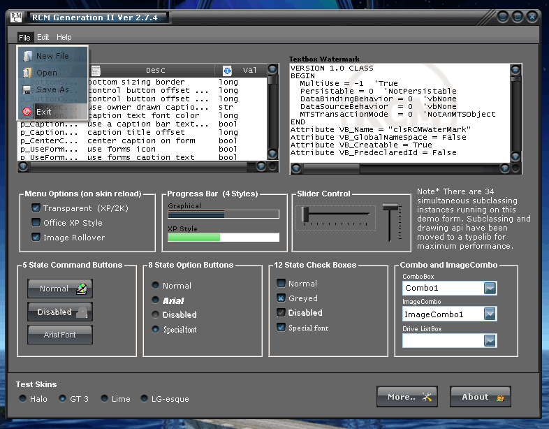



## Final Update \- 2\.7\.4 \- RCM GII \- Client And Non Client Modifier Class

### Description

Ver. 2.74 Is Up! Last of the bugfixes: optionbutton fixed, disabled text effect is back, other misc. fixes/optimizations.. 

----

Ver 2.72 Is Up! This is absolutely the last version, -and by far the best.

Replaced subclasser, and speed and stability have improved tremendously.

Gdi leaks are gone, and library is now crash proof.

Every class rewritten with a mind to compact and efficient code. If you have a prev version, delete it, this is the one you want..

Sept. 8 -Fixed checkbox rollover, small problem with caption, form now does not need to be reloaded on skin change, and fixed/optimized a few things.

----

Ver 2.7 Is Up!

Added progressbars and sliders. Added GPX accelerator typelib in alternate version. Many features changed, improved, added to classes.

New version skins almost everything. Enjoy..

----

Ver 2.6.2 Is Up!

Skins Forms, listview headers, scrollbars, command buttons, option buttons, combo boxes, listbox, dir and file list, picturebox, etc.

Made a lot of changes from 6.2, library speed is greatly improved and is now very stable. Thread acceleration is back in, listview headers fixed, and scrollbar thumbs now support borders. Also included all of the working projects, so that you may add them seperately to projects.

----

Ver. 2.5 Is Up!

Added transparency and extended styles to menus. Now skins: Form/menu/command button/option button/checkbox/combobox/imagecombo/drivelist. Added alpha and 32b bmp support w/ auto-converter, transparency color auto-mapping, and tons more..

Added icons to command buttons, fixed a few things and reuploaded..

----

Ver. 2.4 Is Up!

The first of the common controls are skinned, and the groundwork laid for more, enjoy..

----

Ver. 2.3 Is Up!

New version is 100% flicker free! Added many new features like auto centering caption text, anti-aliasing, transparent regions, new menu features, optional caption text frame image, improvements in rendering speed, and four new skins.

----

Ver. 2.2 Is Up!

Menu issues have been resolved, and some new routines added in preparation for the next update..

----

Ver. 2.1 Is Up!

Fixed a number of issues with nc and menu classes, new rev is stable..

John
 
### More Info
 

             |
---                |---
**Submitted On**   |2006-09-16 17:21:56
**By**             |[Steppenwolfe](https://github.com/Planet-Source-Code/PSCIndex/blob/master/ByAuthor/steppenwolfe.md)
**Level**          |Intermediate
**User Rating**    |5.0 (169 globes from 34 users)
**Compatibility**  |VB 6\.0
**Category**       |[Complete Applications](https://github.com/Planet-Source-Code/PSCIndex/blob/master/ByCategory/complete-applications__1-27.md)
**World**          |[Visual Basic](https://github.com/Planet-Source-Code/PSCIndex/blob/master/ByWorld/visual-basic.md)
**Archive File**   |[Final\_Upda2020339162006\.zip](https://github.com/Planet-Source-Code/steppenwolfe-final-update-2-7-4-rcm-gii-client-and-non-client-modifier-class__1-66155/archive/master.zip)

